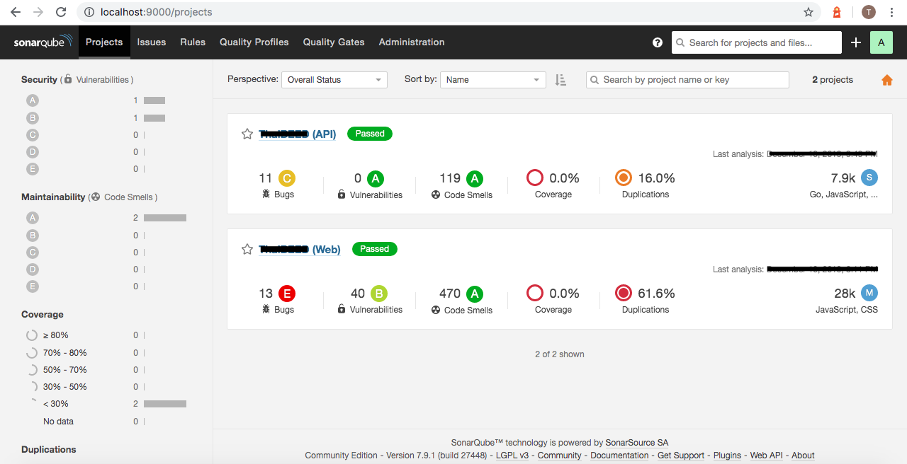

# **SonarQube + PostgreSQL in Docker Compose**



## **Services**

- SonarQube
- PostgreSQL

## **Dependencies**

You need to have dependencies below, before setup SonarQube

- [Docker](https://docs.docker.com/get-started/) & [Docker compose](https://docs.docker.com/compose/install/)
- [SonarQube Scanner](https://docs.sonarqube.org/latest/analysis/scan/sonarscanner/)
- Your running project

## **Preparation**

1. SonarQube & PostgreSQL require directory to synchonize file to your harddisk (if need), 
you need to create folder name below in root directory:

- postgresql
- postgresql_data
- sonarqube_conf
- sonarqube_data
- sonarqube_extensions

2. Ports

- SonarQube port number `9000`
- PostgreSQL port number `5432`

## **Setup**

In root directory :

```bash
$ docker-compose up --build
```

waiting for installation and start service up until it shows message below in your console log :

```bash
.
.
.
sonarqube_1  | yyyy.MM.dd HH:mm:ss INFO  ce[][o.s.s.e.EsClientProvider] Connected to local Elasticsearch: [127.0.0.1:9001]
sonarqube_1  | yyyy.MM.dd HH:mm:ss INFO  ce[][o.sonar.db.Database] Create JDBC data source for jdbc:postgresql://db:5432/sonar
sonarqube_1  | yyyy.MM.dd HH:mm:ss INFO  ce[][o.s.s.p.ServerFileSystemImpl] SonarQube home: /opt/sonarqube
sonarqube_1  | yyyy.MM.dd HH:mm:ss INFO  ce[][o.s.c.c.CePluginRepository] Load plugins
sonarqube_1  | yyyy.MM.dd HH:mm:ss INFO  ce[][o.s.c.c.ComputeEngineContainerImpl] Running Community edition
sonarqube_1  | yyyy.MM.dd HH:mm:ss INFO  ce[][o.s.ce.app.CeServer] Compute Engine is operational
sonarqube_1  | yyyy.MM.dd HH:mm:ss INFO  app[][o.s.a.SchedulerImpl] Process[ce] is up
sonarqube_1  | yyyy.MM.dd HH:mm:ss INFO  app[][o.s.a.SchedulerImpl] SonarQube is up
```

### **1. SonarQube**

By default, you can access it with user name and password below:

```
user : admin
password : admin
```

**Preparation**

For SonarQube, you need to install another service or command. 
It is SonarScanner, download [here](https://docs.sonarqube.org/latest/analysis/scan/sonarscanner/).
It will help you scan your source code.

Before go to next step, don't forget set the command to your system path:

```bash
# Ex. MacOS
$ export PATH=$PATH:YOUR_SONAR_SCANNER_DIRECTORY/bin

# Testing the command
$ sonar-scanner -h

# output
INFO:
INFO: usage: sonar-scanner [options]
INFO:
INFO: Options:
INFO:  -D,--define <arg>     Define property
INFO:  -h,--help             Display help information
INFO:  -v,--version          Display version information
INFO:  -X,--debug            Produce execution debug output
```

Access SonarQube via `localhost:9000`

**Configuration**

Go to security tab, create token and record it into secur place.

**Synchronization**

Create project in SonarQube, preparing to sync with your project.
You can use the token to create the project.

and then follow their step.

By go to root directory of your project, create file name `sonar-project.properties`.
Add content below to the file:

```
sonar-project.properties
sonar.projectKey=YOUR_PROJECT_KEY
```

Run command below in your root project directory:

```bash
sonar-scanner \
  -Dsonar.projectKey=YOUR_PROJECT_KEY \
  -Dsonar.sources=. \
  -Dsonar.host.url=http://localhost:9000 \
  -Dsonar.login=YOUR_TOKEN
```

Enjoy the scan result in your SonarQube dashboard (`localhost:9000`) 

### **2. PostgreSQL**

By default, you can access it with user name and password below:

```
user : sonar
password : sonar
```

## **License**

MIT